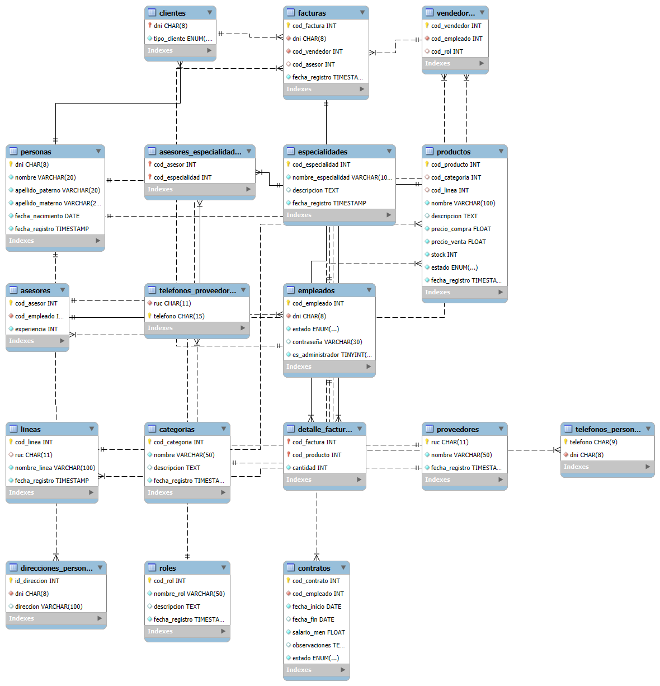

# Base de Datos: Explicación y Diagrama

Este proyecto contiene una base de datos diseñada para gestionar la información relevante del parcial de CDS 25-1.

## Descripción General
La base de datos almacena información clave sobre entidades y relaciones importantes para el sistema. Incluye tablas para usuarios, productos, transacciones, y otras entidades relevantes según el contexto del parcial.

## Tablas Principales
- **Usuarios**: Guarda la información personal y credenciales de los usuarios.
- **Productos**: Contiene los detalles de los productos o recursos gestionados.
- **Transacciones**: Registra las operaciones o eventos importantes entre usuarios y productos.

## Diagrama de la Base de Datos
A continuación se muestra el diagrama relacional de la base de datos. Si tienes el archivo `fabia-natura.png` en la raíz del proyecto, el diagrama se visualizará automáticamente:

  

## Cómo visualizar el diagrama
1. Asegúrate de tener el archivo `fabia-natura.png` dentro de la carpeta `diagramas` en el proyecto.
2. Abre este archivo `README.md` en un visualizador de Markdown compatible o en GitHub para ver el diagrama.

---

## Tablas de la Base de Datos

- **Personas**: Información básica de personas (DNI, nombre, apellidos, fecha de nacimiento, registro).
- **Teléfonos_Personas**: Teléfonos asociados a personas.
- **Direcciones_Personas**: Direcciones asociadas a personas.
- **Empleados**: Datos de empleados, estado, contraseña y si es administrador.
- **Roles**: Roles de empleados (nombre, descripción, registro).
- **Vendedores**: Relación entre empleados y su rol de vendedor.
- **Especialidades**: Especialidades disponibles para asesores.
- **Asesores**: Asesores y su experiencia.
- **Asesores_Especialidades**: Relación N:M entre asesores y especialidades.
- **Clientes**: Personas que son clientes, tipo de cliente.
- **Contratos**: Contratos de empleados (fechas, salario, estado).
- **Proveedores**: Empresas proveedoras (RUC, nombre, registro).
- **Teléfonos_Proveedores**: Teléfonos asociados a proveedores.
- **Categorias**: Categorías de productos.
- **Lineas**: Líneas de productos asociadas a proveedores.
- **Productos**: Productos con sus detalles, stock y estado.
- **Facturas**: Ventas realizadas (cliente, vendedor, asesor, fecha, estado).
- **Detalle_Facturas**: Detalles de productos vendidos en cada factura.

## Procedimientos Almacenados (SPs) Principales

- **Asesores**
  - `AgregarAsesor`: Agrega un asesor con datos personales y experiencia.
  - `ObtenerAsesores` / `ObtenerAsesorPorCodigo`: Consulta asesores registrados.
  - `ActualizarAsesor`: Actualiza los datos de un asesor.

- **Asesores_Especialidades**
  - `AgregarEspecialidadAAsesor`: Asigna una especialidad a un asesor.
  - `ObtenerEspecialidadesDeAsesor`: Consulta especialidades de un asesor.

- **Categorias**
  - `AgregarCategoria`: Crea una nueva categoría.
  - `ObtenerTodasLasCategorias` / `ObtenerCategoriaPorId`: Consulta categorías.
  - `ObtenerProductosPorCategoria`: Lista productos de una categoría.
  - `ActualizarCategoria`: Modifica una categoría.

- **Clientes**
  - `AgregarCliente`: Agrega un cliente y su persona.
  - `ObtenerTodosLosClientes` / `ObtenerClientePorDNI`: Consulta clientes.
  - `ObtenerProductosCompradosPorCliente`: Lista productos adquiridos por un cliente.

- **Contratos**
  - `AgregarContrato`: Agrega un contrato a un empleado.
  - `ObtenerTodosLosContratos` / `ObtenerContratoPorCodigo`: Consulta contratos.
  - `ActualizarContrato`: Modifica un contrato.
  - `DesactivarContrato`: Desactiva un contrato y el empleado asociado.

- **Detalle_Facturas**
  - `CrearDetalleFactura`: Agrega un detalle de factura y actualiza stock.
  - `ObtenerTodosLosDetallesDeFacturas` / `ObtenerDetallesDeFactura`: Consulta detalles de facturas.
  - `EliminarDetalleFactura`: Elimina un detalle de factura y actualiza stock.

- **Otros SPs**: Existen procedimientos similares para las entidades restantes (personas, productos, proveedores, roles, líneas, especialidades, teléfonos, facturas, etc.), siguiendo la lógica de alta, consulta, actualización y baja.